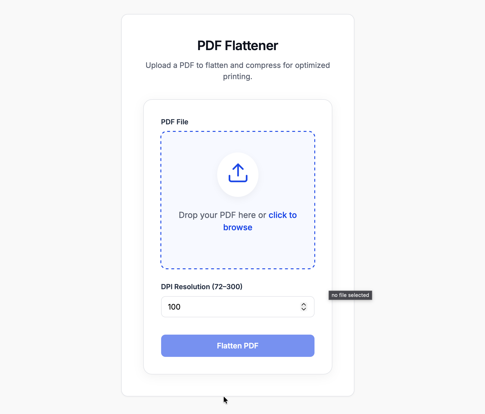

<p align="center">
  <h1 align="center">Print Spool Optimizer</h1>
  <p align="center">OpenSource Project | Open for Contribution  </p>
  <p align="center">
    A high-performance PDF flattening and compression utility  
    designed to prevent printer memory overflow and optimize print spooling.
  </p>
</p>

<p align="center">
  
</p>

<p align="center">
  <a href="#">Python 3.8+</a> •
  <a href="#">MIT License</a> •
  <a href="#">Open Source</a>
</p>

---

## Overview
The Print Spool Optimizer is a Python utility designed to flatten and compress PDF documents. By converting complex vector graphics, fonts, and layers into standard grayscale images, it reduces the processing load on printer hardware. This prevents memory overflow and ensures rapid print spooling for large documents.

<p align="center">
  
</p>
## Prerequisites
* Python 3.8 or higher

## Installation

To prevent dependency conflicts with your system's global Python installation, you must run this tool within an isolated virtual environment.

### 1. Create a Virtual Environment
Navigate to the root directory of this project in your terminal and execute the following command to create a virtual environment named `venv`:

```bash
python3 -m venv venv
```

### 2. Activate the Virtual Environment
You must activate the environment before installing dependencies or executing the script. Your terminal prompt will change to indicate the environment is active.

#### For macOS / Linux:
```
source venv/bin/activate
```

#### Windows (Command Prompt):
```
venv\Scripts\activate.bat
```

#### Windows (PowerShell):
```
venv\Scripts\Activate.ps1
```

### 3. Install Dependencies

Once the virtual environment is active, install the required packages using the provided requirements file:
```
pip install -r requirements.txt
```

## How to Execute this command :
```
python spool_optimizer.py -i input_file_name.pdf -o output_file_name.pdf
```

### CLI Options

| Flag | Default | Description |
|------|---------|-------------|
| `-i` / `--input` | *(required)* | Path to the input PDF file |
| `-o` / `--output` | *(required)* | Path for the output PDF file |
| `--dpi` | `100` | Rasterization resolution (72–300) |
| `--workers` | `0` | Worker processes for parallel rendering. `0` = all CPU cores. `1` = sequential (no multiprocessing) |

**Example — use 4 workers for a large PDF:**
```
python spool_optimizer.py -i large_doc.pdf -o output.pdf --dpi 150 --workers 4
```

### Deactivation
When you are finished using the tool, you can exit the virtual environment by running:
```
deactivate
```

---

## 🐳 Docker Deployment

Run the app in a fully isolated container — no Python or venv setup required.

### Quick start with Docker Compose (recommended)
```bash
docker compose up --build
```
The web UI will be available at **http://localhost:5000**.

### Build and run manually
```bash
# Build the image
docker build -t pdf-spool-optimizer .

# Run the container
docker run -p 5000:5000 pdf-spool-optimizer
```

### Stop the container
```bash
docker compose down
```

### Runtime environment variables

| Variable | Default | Description |
|---|---|---|
| `FLASK_ENV` | `production` | Set to `development` to enable debug mode |
| `FLASK_HOST` | `127.0.0.1` | Bind address (use `0.0.0.0` in containers) |
| `FLASK_PORT` | `5000` | Port the dev server listens on |

---

**Author:** Mathi Yuvarajan T.K
